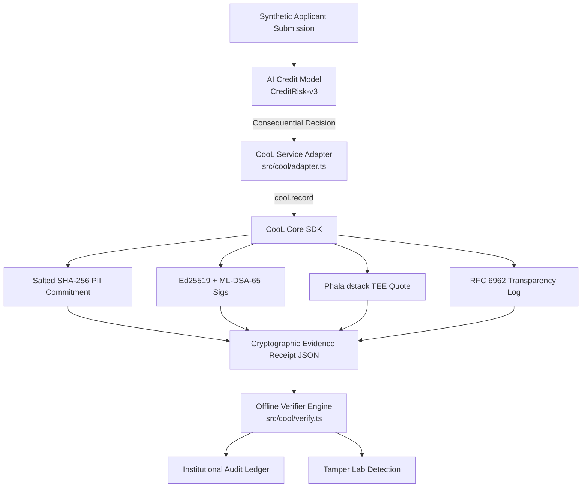

# 🛡️ CooL.ledger — AI Decision Evidence & Audit Platform

> **Primary Message:**  
> *"AI decisions can be disputed later. CooL creates cryptographically verifiable evidence at decision time."*

---

## 1. Problem Statement
Autonomous AI credit underwriting, loan scoring, and financial risk models evaluate millions of consequential decisions daily. When an applicant disputes a rejected loan or regulators examine subprime risk models, institutions must prove **exactly** what data was evaluated and what decision was produced at execution time.

Traditional application database logs fail in regulatory audits because:
- **Database logs are editable:** System administrators or bad actors can alter decision history retroactively.
- **Logs are centralized:** They depend entirely on operator infrastructure trust.
- **Raw PII exposure:** Storing unhashed applicant financial data violates GDPR, EU AI Act, and DPDP rules.
- **Vendor API dependence:** Third-party auditors cannot independently verify records offline.

---

## 2. Solution Overview
**CooL.ledger** solves this by establishing an immutable cryptographic evidence ledger directly at the consequential AI decision boundary. At the exact millisecond an AI model evaluates an applicant, CooL seals the input state and decision output using:
- **Salted SHA-256 PII Commitments:** Zero raw PII persisted in evidence receipts.
- **Hybrid Key Signatures:** Dual Ed25519 classical and ML-DSA-65 (Dilithium FIPS 204) post-quantum signatures.
- **Phala Network `dstack` TEE Enclave Attestation:** Hardware-rooted non-self-edit execution environment quotes.
- **RFC 6962 Transparency Log:** Append-only Merkle tree inclusion proofs.
- **100% Offline Verifier (`cool verify`):** Independent verification requiring zero vendor API calls.

---

## 3. Why CooL is Essential (Not an Add-On)

> *"At the consequential AI decision boundary, CooL creates the cryptographic evidence that the rest of the application audits. Without this evidence layer, the application falls back to ordinary application logs and cannot provide the same verification guarantees."*

Without CooL:
- Any logged decision can be repudiated in court or during regulatory examination.
- Re-evaluating historical decisions requires trusting the institution's private database state.
- Post-quantum security is completely absent.

With CooL:
- The decision receipt is cryptographically sealed and unforged (`isUnforged: true`).
- Any post-hoc alteration to input parameters or decision outcomes instantly triggers `VERDICT: TAMPER DETECTED`.

---

## 4. Exactly Where CooL is Used

CooL SDK primitives are encapsulated strictly inside a dedicated service adapter layer (`src/cool/adapter.ts`), ensuring the consuming application logic remains clean while maintaining a strict fail-closed security boundary.

| Stage | Responsible Component | Implementation Detail |
|---|---|---|
| **AI Model Evaluation** | [`src/model/creditModel.ts`](file:///c:/Users/Tejas/Desktop/Reverse-Hackthon/src/model/creditModel.ts) | Executes `CreditRisk-v3` model and generates recommendation metadata. |
| **CooL Decision Boundary** | [`src/cool/adapter.ts`](file:///c:/Users/Tejas/Desktop/Reverse-Hackthon/src/cool/adapter.ts) | Invokes `cool.record()` at decision generation time; enforces fail-closed error handling. |
| **Evidence Storage** | [`src/services/evidenceService.ts`](file:///c:/Users/Tejas/Desktop/Reverse-Hackthon/src/services/evidenceService.ts) | Persists clean evidence receipts and manages demo ledger state. |
| **Offline Verification** | [`src/cool/verify.ts`](file:///c:/Users/Tejas/Desktop/Reverse-Hackthon/src/cool/verify.ts) | Evaluates 5 independent cryptographic checks offline (`cool verify`). |
| **Tamper Detection** | [`src/components/TamperLabTab.tsx`](file:///c:/Users/Tejas/Desktop/Reverse-Hackthon/src/components/TamperLabTab.tsx) | Interactive forensics lab demonstrating live tamper detection and restoration. |

---

## 5. System Architecture

```
AI Model
   ↓
Decision Boundary
   ↓
CooL SDK
   ↓
Cryptographic Evidence
   ↓
Receipt
   ↓
Audit / Verification
```



---

## 6. Decision → Evidence Workflow
1. User or automated pipeline submits applicant parameters (`Synthetic Applicant #8842`).
2. Credit model (`CreditRisk-v3`) produces autonomous decision (`APPROVED`).
3. At the exact moment of decision output, `coolAdapter.recordDecisionEvidence()` is called.
4. CooL computes salted state commitment `H(SALT : input || output)`.
5. Dual Ed25519 & ML-DSA-65 signatures are generated over the combined state hash.
6. Hardware enclave quote and RFC 6962 Merkle log proof are generated.
7. Clean evidence receipt JSON is returned and persisted.

---

## 7. Verification Workflow
1. Auditor opens receipt JSON in the **Evidence Receipt Inspector** or CLI verifier.
2. `coolAdapter.verifyDecisionEvidence(receipt)` executes **100% offline**:
   - Check 1: Salted hash commitment integrity against input/output states.
   - Check 2: Classical Ed25519 public key signature verification.
   - Check 3: Post-quantum ML-DSA-65 (FIPS 204) signature verification.
   - Check 4: RFC 6962 Merkle tree inclusion proof recalculation.
   - Check 5: Phala dstack TEE hardware quote attestation validation.
3. If all pass: Displays `✓ Evidence authentic` / `VERDICT: UNFORGED`.

---

## 8. Tamper Demonstration Flow
1. Open the **Tamper Lab** tab (`src/components/TamperLabTab.tsx`).
2. Click **TAMPER WITH EVIDENCE** to simulate an attack (e.g. flipping decision `APPROVED` → `REJECTED` or mutating annual income from `$145k` → `$15k`).
3. Verifier engine re-evaluates payload and returns:
   - `EVIDENCE TAMPERED`
   - `✗ Verification failed`
   - `✗ Commitment mismatch / signature mismatch`
   - `✗ Receipt cannot be trusted`
4. Click **Restore Original** to restore the genuine receipt and re-verify successfully (`ORIGINAL: ✓ VERIFIED`).

---

## 9. Local Setup Instructions

### Prerequisites
- Node.js 18+ or 20+
- npm or yarn

### Installation
```bash
# 1. Clone repository
git clone https://github.com/tejas-coder28/Reverse-Hackthon.git
cd Reverse-Hackthon

# 2. Install dependencies
npm install

# 3. Start local development server
npm run dev

# 4. Run test suite
npx vitest run

# 5. Build for production
npm run build
```

---

## 10. Environment Variables
Copy `.env.example` to `.env` for custom environment setup:

```bash
cp .env.example .env
```

| Variable Name | Description | Sample Value |
|---|---|---|
| `VITE_COOL_DOMAIN` | Institutional domain namespace | `nbfc.credit_scoring` |
| `VITE_ENABLE_TEE_ATTESTATION` | Enable Phala dstack TEE quotes | `true` |
| `VITE_MODEL_ID` | Autonomous AI model identifier | `CreditRisk-v3` |
| `VITE_MODEL_VERSION` | Production model version string | `3.4.1-prod` |

---

## 11. Vercel & Production Deployment

### Deploying to Vercel
This project includes a pre-configured [`vercel.json`](file:///c:/Users/Tejas/Desktop/Reverse-Hackthon/vercel.json) file supporting Vite SPA rewrites.

```bash
# Using Vercel CLI
npx vercel
```
Or import directly via Vercel Dashboard connected to your GitHub repository.

---

## 12. System Limitations & Scope Bounds

1. **Browser TEE Simulation:** Browser environments execute web-subtle crypto for hash commitments. Hardware SGX/TDX quote attestation is simulated via Phala dstack client specification.
2. **Scope Disclaimer:** CooL cryptographic verification proves **record non-repudiation and evidence integrity**. It does **not** prove model fairness, accuracy, or bias-free execution.

---

## 13. Future Roadmap & Improvements
- [ ] Automated Intel SGX/TDX Quote Verification via remote attestation server.
- [ ] On-Chain Merkle Tree Anchor publishing to Ethereum / L2 transparency logs.
- [ ] Multi-tenant institutional key rotation management.

---

## COOL INTEGRATION MAP

Decision generation:
[creditModel.ts](file:///c:/Users/Tejas/Desktop/Reverse-Hackthon/src/model/creditModel.ts)

CooL record:
[adapter.ts](file:///c:/Users/Tejas/Desktop/Reverse-Hackthon/src/cool/adapter.ts)

Evidence storage:
[evidenceService.ts](file:///c:/Users/Tejas/Desktop/Reverse-Hackthon/src/services/evidenceService.ts)

Verification:
[verify.ts](file:///c:/Users/Tejas/Desktop/Reverse-Hackthon/src/cool/verify.ts)

Tamper detection:
[TamperLabTab.tsx](file:///c:/Users/Tejas/Desktop/Reverse-Hackthon/src/components/TamperLabTab.tsx)
