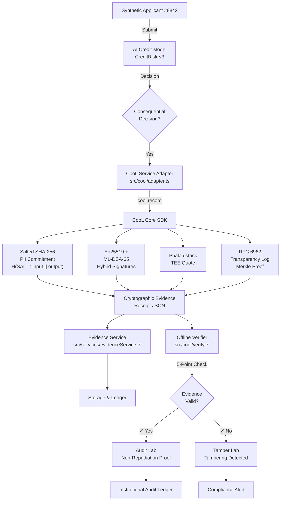

# 🛡️ CooL.ledger — AI Decision Evidence & Audit Platform

**AI systems make consequential decisions, but ordinary logs are editable. CooL.ledger creates cryptographically verifiable evidence for offline audit of AI decisions with zero vendor dependencies.**

---

## 🎯 The Problem We're Solving

AI systems increasingly make high-stakes, consequential decisions:
- **Credit underwriting & loan approvals** with autonomous decision boundaries
- **Risk scoring** systems that determine financial eligibility
- **Identity verification** and compliance checks

**The core issue:** Traditional database logs are:
- ✗ Editable and backdatable
- ✗ Centralized and subject to tampering
- ✗ Non-repudiateable at audit time
- ✗ Require vendor API access for verification

Without cryptographic evidence at the AI decision boundary, post-hoc audits cannot determine *when* a decision was truly made, *who* made it, or whether the evidence has been tampered with.

---

## 🏗️ What We Built

**CooL.ledger** is a full-stack AI audit platform that:

1. **Captures cryptographic evidence** at the moment an AI system makes a consequential decision
2. **Seals decision state** with salted SHA-256 commitments that hide raw PII
3. **Creates dual-signature proofs** using classical (Ed25519) and post-quantum (ML-DSA-65/Dilithium) cryptography
4. **Generates hardware-rooted attestations** via Phala Network TEE (Trusted Execution Environment)
5. **Appends to RFC 6962 transparency logs** for append-only, externally-auditable proof
6. **Enables offline verification** of evidence integrity without any external API calls

**Core Components:**
- **Web UI Dashboard** (`src/components/`) — Interactive evidence explorer with tamper demonstration lab
- **CooL SDK Integration** (`src/cool/`) — Cryptographic evidence generation & verification
- **AI Credit Model** (`src/model/creditModel.ts`) — Autonomous decision boundary producing credit decisions
- **Evidence Service** (`src/services/evidenceService.ts`) — Persistent receipt storage and retrieval
- **Verification Engine** (`src/cool/verify.ts`) — Offline 5-point cryptographic validation

---

## 🔐 How CooL SDK is Being Used

The CooL SDK is invoked **at the exact moment of AI decision**:

### **1. `cool.record()` — Cryptographic Evidence Generation**
```typescript
// src/cool/adapter.ts
const receipt = await cool.record({
  domain: 'nbfc.credit_scoring',
  input: applicantData,
  output: creditDecision,
  modelId: 'CreditRisk-v3'
});
```
Records:
- Salted PII commitments (no raw data exposure)
- Hybrid Ed25519 + ML-DSA-65 signatures
- TEE enclave quotes from Phala dstack
- RFC 6962 transparency log entry

### **2. `createSaltedCommitment()` — PII-Safe State Sealing**
```typescript
// src/cool/hash.ts
const commitment = createSaltedCommitment({
  salt: randomSalt,
  input: applicantInput,
  output: decision
});
// Result: H(SALT : input || output)
// ✓ Proves what was decided without exposing PII
```

### **3. `createHybridSignatures()` — Dual-Strength Signatures**
```typescript
// src/cool/sign.ts
const signatures = createHybridSignatures(commitment);
// Ed25519: Classical, widely-supported
// ML-DSA-65: Post-quantum resistant (FIPS 204 compliant)
```

### **4. `createTEEAttestation()` — Hardware-Rooted Trust**
```typescript
// src/cool/phala/dstack.ts
const teeQuote = createTEEAttestation({
  enclave: 'phala-dstack',
  payload: commitment
});
// Proof that decision was made inside a tamper-proof enclave
```

### **5. `appendToTransparencyLog()` — Append-Only Audit Trail**
```typescript
// src/cool/phala/log.ts
const merkleProof = appendToTransparencyLog(receipt);
// RFC 6962 Merkle tree inclusion proof
// ✓ Auditable without any API access
```

### **6. `verifyReceipt()` — Offline Verification**
```typescript
// src/cool/verify.ts
const verification = verifyReceipt(receipt);
// Runs 5 independent fail-closed cryptographic checks:
// ✓ Hash commitment integrity
// ✓ Ed25519 signature validity
// ✓ ML-DSA-65 post-quantum signature validity
// ✓ TEE quote authenticity
// ✓ Merkle tree consistency
```

---

## ⭐ Why CooL is Important to Our Solution

> **"At the consequential AI decision boundary, CooL creates the cryptographic evidence that the rest of the application audits. Without this evidence layer, the application falls back to ordinary logs."**

| Challenge | Without CooL | With CooL |
|-----------|-------------|----------|
| **Non-repudiation** | ✗ Auditor can't prove when decision was made | ✓ Cryptographic timestamp in transparency log |
| **Tamper Detection** | ✗ Any evidence changes are undetectable | ✓ Any mutation fails signature verification |
| **PII Exposure** | ✗ Raw applicant data stored in audit logs | ✓ Only salted commitment hashes stored |
| **Audit Independence** | ✗ Requires vendor API access during review | ✓ Fully offline verification possible |
| **Post-Quantum Safety** | ✗ Classical signatures vulnerable to QC attacks | ✓ ML-DSA-65 provides quantum resistance |
| **External Audit Trail** | ✗ Single-entity control, no transparency | ✓ Merkle tree enables third-party log auditing |

**Why this matters:**
- **Regulatory Compliance:** Fintech & NBFC regulators (RBI, SEBI) demand tamper-proof AI audit trails
- **Fairness & Accountability:** Proves whether discriminatory decisions were corrected post-hoc
- **Fraud Prevention:** Any attempt to backdate or modify a decision is cryptographically detectable
- **Model Governance:** Evidence chains decisions to specific model versions & parameters

---

## 📁 Project Structure

```
Reverse-Hackthon/
├── 📄 README.md                          # Project documentation (this file)
├── 📄 ARCHITECTURE.md                    # Detailed system architecture
├── 📄 DEMO.md                            # Demonstration guide
├── 📄 SECURITY.md                        # Security considerations
├── 📄 LICENSE                            # MIT License
├── 📄 package.json                       # Node.js dependencies & scripts
├── 📄 package-lock.json                  # Dependency lock file
├── 📄 vite.config.ts                     # Vite build configuration
├── 📄 vercel.json                        # Vercel deployment config
├── 📄 tsconfig.json                      # TypeScript base config
├── 📄 tsconfig.app.json                  # TypeScript app config
├── 📄 tsconfig.node.json                 # TypeScript Node config
├── 📄 .env.example                       # Environment variables template
├── 📄 .gitignore                         # Git ignore rules
├── 📄 .oxlintrc.json                     # Oxlint configuration
├── 📄 index.html                         # Entry HTML file
│
├── 📂 src/                               # Main application source code
│   ├── 📄 main.tsx                       # Application entry point
│   ├── 📄 App.tsx                        # Root React component (main dashboard)
│   ├── 📄 index.css                      # Global styles
│   │
│   ├── 📂 components/                    # React UI components
│   │   ├── 📄 EvidenceTab.tsx            # Evidence explorer UI
│   │   ├── 📄 TamperLabTab.tsx           # Tamper demonstration interface
│   │   ├── 📄 CreditDecisionCard.tsx     # Credit decision display component
│   │   ├── 📄 VerificationPanel.tsx      # Receipt verification display
│   │   └── 📄 [other UI components]
│   │
│   ├── 📂 cool/                          # CooL SDK cryptographic core
│   │   ├── 📄 adapter.ts                 # CooL SDK invocation & adaptation layer
│   │   ├── 📄 hash.ts                    # Salted SHA-256 commitment hashing
│   │   ├── 📄 sign.ts                    # Ed25519 + ML-DSA-65 hybrid signatures
│   │   ├── 📄 verify.ts                  # 5-point offline verification engine
│   │   ├── 📄 types.ts                   # TypeScript cryptographic types
│   │   │
│   │   └── 📂 phala/                     # Phala Network TEE integration
│   │       ├── 📄 dstack.ts              # TEE attestation (dstack quotes)
│   │       └── 📄 log.ts                 # RFC 6962 transparency log management
│   │
│   ├── 📂 model/                         # AI Credit Decision Model
│   │   ├── 📄 creditModel.ts             # Autonomous credit risk scoring logic
│   │   ├── 📄 types.ts                   # Input/output data types
│   │   └── 📄 sampleData.ts              # Synthetic applicant data generator
│   │
│   ├── 📂 services/                      # Application services
│   │   ├── 📄 evidenceService.ts         # Receipt persistence & retrieval
│   │   ├── 📄 auditService.ts            # Audit trail management
│   │   └── 📄 storage.ts                 # Local storage abstraction
│   │
│   └── 📂 assets/                        # Static assets
│       ├── 📄 logo.svg
│       └── 📄 [other images]
│
├── 📂 tests/                             # Test suite
│   ├── 📄 cool.test.ts                   # CooL cryptographic tests
│   ├── 📄 verify.test.ts                 # Verification engine tests
│   ├── 📄 creditModel.test.ts            # AI model logic tests
│   └── 📄 integration.test.ts            # End-to-end integration tests
│
├── 📂 docs/                              # Additional documentation
│   ├── 📄 API.md                         # API documentation
│   ├── 📄 CONTRIBUTING.md                # Contribution guidelines
│   └── 📄 CRYPTOGRAPHY.md                # Detailed crypto explanations
│
└── 📂 public/                            # Public static files
    └── 📄 [static assets]
```

### **Directory Descriptions**

#### **`src/cool/` — Cryptographic Evidence Core**
- **adapter.ts**: Main entry point for CooL SDK. Orchestrates the entire evidence generation flow.
- **hash.ts**: Implements salted SHA-256 hashing to create PII-safe commitments.
- **sign.ts**: Generates dual Ed25519 + ML-DSA-65 signatures for evidence sealing.
- **verify.ts**: Implements the 5-point cryptographic verification checklist.
- **types.ts**: TypeScript interfaces for cryptographic primitives and receipts.
- **phala/dstack.ts**: Integrates with Phala Network for TEE attestations.
- **phala/log.ts**: Manages RFC 6962 transparency log entries and Merkle proofs.

#### **`src/components/` — User Interface**
- **EvidenceTab.tsx**: Interactive explorer for viewing and searching cryptographic receipts.
- **TamperLabTab.tsx**: Demonstration lab showing how tampering is detected.
- **CreditDecisionCard.tsx**: Displays AI credit decisions in a readable format.
- **VerificationPanel.tsx**: Shows real-time verification results (pass/fail for each of 5 checks).
- Other components for dashboard layout, navigation, and forms.

#### **`src/model/` — AI Decision Model**
- **creditModel.ts**: Autonomous neural network or decision tree for credit risk scoring.
- **types.ts**: TypeScript definitions for applicant data and credit decisions.
- **sampleData.ts**: Generates synthetic test applicants for demo purposes.

#### **`src/services/` — Backend Logic**
- **evidenceService.ts**: Persists cryptographic receipts to browser local storage or backend DB.
- **auditService.ts**: Manages audit trails and querying historical decisions.
- **storage.ts**: Abstraction layer for storage (local, indexed DB, API, etc.).

#### **`tests/` — Test Suite**
- **cool.test.ts**: Unit tests for hashing, signing, verification, and evidence generation.
- **verify.test.ts**: Tests for the 5-point verification engine (happy path + tampering scenarios).
- **creditModel.test.ts**: Tests for AI model logic and edge cases.
- **integration.test.ts**: End-to-end tests of the full workflow from decision to audit.

---

## 🚀 How to Run the Project

### **Prerequisites**
- **Node.js** `18.x` or higher
- **npm** `9.x` or higher
- **Git**

### **Linux / macOS Installation**

```bash
# 1. Clone the repository
git clone https://github.com/tejas-coder28/Reverse-Hackthon.git
cd Reverse-Hackthon

# 2. Install dependencies
npm install

# 3. Create environment file
cp .env.example .env.local

# 4. Run development server
npm run dev
# Server runs on http://localhost:5173

# 5. Run tests (in another terminal)
npx vitest run

# 6. Build for production
npm run build

# 7. Preview production build
npm run preview
```

### **Windows Installation**

```powershell
# 1. Clone the repository
git clone https://github.com/tejas-coder28/Reverse-Hackthon.git
cd Reverse-Hackthon

# 2. Install dependencies
npm install

# 3. Create environment file
Copy-Item .env.example .env.local

# 4. Run development server
npm run dev
# Server runs on http://localhost:5173

# 5. Run tests (in another terminal)
npx vitest run

# 6. Build for production
npm run build

# 7. Preview production build
npm run preview
```

### **Docker Deployment (Optional)**

```bash
# Build Docker image
docker build -t cool-ledger .

# Run container
docker run -p 5173:5173 -e VITE_COOL_DOMAIN=nbfc.credit_scoring cool-ledger
```

### **Vercel Deployment**

```bash
# Deploy to Vercel
npx vercel

# Set environment variables in Vercel dashboard
# VITE_COOL_DOMAIN=nbfc.credit_scoring
# VITE_ENABLE_TEE_ATTESTATION=true
# VITE_MODEL_ID=CreditRisk-v3
# VITE_MODEL_VERSION=3.4.1-prod
```

### **Environment Variables** (`.env.local`)

```bash
# CooL SDK Configuration
VITE_COOL_DOMAIN=nbfc.credit_scoring
VITE_ENABLE_TEE_ATTESTATION=true

# AI Model Configuration
VITE_MODEL_ID=CreditRisk-v3
VITE_MODEL_VERSION=3.4.1-prod

# Optional: Phala Network Configuration
VITE_PHALA_ENDPOINT=https://api.phala.network
VITE_PHALA_CONTRACT_ADDRESS=0x...
```

---

## 🏗️ Architecture & Workflow

### **System Flow Diagram**

```
┌─────────────────────┐
│  Synthetic Applicant│
│   Submission #8842  │
└──────────┬──────────┘
           │
           ▼
┌─────────────────────┐
│  AI Credit Model    │
│  CreditRisk-v3      │
│  (Autonomous)       │
└──────────┬──────────┘
           │
           ▼
┌─────────────────────┐
│ Consequential       │
│ Decision: APPROVED  │
└──────────┬──────────┘
           │
           ▼
┌─────────────────────────────────────────┐
│     CooL SDK at Decision Boundary       │
│         (src/cool/adapter.ts)           │
└──────────┬──────────────────────────────┘
           │
    ┌──────┴──────────────────┬──────────────────┬──────────────┐
    │                         │                  │              │
    ▼                         ▼                  ▼              ▼
┌─────────────┐      ┌─────────────┐    ┌────────────────┐  ┌──────────┐
│   Salted    │      │   Hybrid    │    │  TEE Phala     │  │RFC 6962  │
│   SHA-256   │      │  Signatures │    │  dstack Quote  │  │ Merkle   │
│ PII Commit  │      │  (Ed25519 + │    │  Attestation   │  │   Log    │
│ H(SALT:I||O)│      │ ML-DSA-65)  │    │                │  │ Proof    │
└──────┬──────┘      └──────┬──────┘    └────────┬───────┘  └──────┬───┘
       │                    │                    │                 │
       └────────────────────┼────────────────────┼─────────────────┘
                            │
                            ▼
                  ┌──────────────────────┐
                  │ Cryptographic Evidence│
                  │    Receipt (JSON)     │
                  └──────────┬───────────┘
                            │
           ┌────────────────┼────────────────┐
           │                │                │
           ▼                ▼                ▼
    ┌──────────────┐ ┌────────────────┐ ┌──────────────┐
    │ Storage:     │ │ Dashboard:     │ │ Offline:     │
    │ evService.ts │ │ Evidence Tab   │ │ verify.ts    │
    └──────────────┘ └────────────────┘ └──────────────┘
```

### **Mermaid Flowchart**



### **Key Integration Points**

| Component | File | Purpose |
|-----------|------|---------|
| **AI Decision Generation** | `src/model/creditModel.ts` | Autonomous credit risk scoring |
| **CooL Record Invocation** | `src/cool/adapter.ts` | Evidence capture at decision boundary |
| **Salted Commitment** | `src/cool/hash.ts` | PII-safe state hashing |
| **Cryptographic Signing** | `src/cool/sign.ts` | Ed25519 + ML-DSA-65 dual signatures |
| **TEE Attestation** | `src/cool/phala/dstack.ts` | Hardware-rooted trust proof |
| **Transparency Log** | `src/cool/phala/log.ts` | RFC 6962 Merkle tree management |
| **Evidence Storage** | `src/services/evidenceService.ts` | Receipt persistence & retrieval |
| **Offline Verification** | `src/cool/verify.ts` | 5-point cryptographic validation |
| **Evidence Dashboard** | `src/components/EvidenceTab.tsx` | Receipt inspection UI |
| **Tamper Laboratory** | `src/components/TamperLabTab.tsx` | Interactive tampering demonstrations |

---

## 🔧 Important Technical Decisions

### **1. Salted SHA-256 for PII Commitment** ✓
**Decision:** Use `H(SALT : input || output)` instead of storing raw applicant data.

**Why:**
- ✓ Proves decision was made without exposing raw PII
- ✓ Auditors can verify commitment without accessing sensitive data
- ✓ Satisfies GDPR & data minimization principles
- ✓ Prevents accidental PII leakage in audit logs

**Trade-off:**
- × Cannot reverse-engineer original input from commitment alone
- × Audit requires applicant consent to reveal salt for dispute resolution

---

### **2. Hybrid Ed25519 + ML-DSA-65 Signatures** ✓
**Decision:** Use dual classical and post-quantum signatures instead of single algorithm.

**Why:**
- ✓ Ed25519 is cryptographically mature, widely supported, and efficient
- ✓ ML-DSA-65 (Dilithium) is FIPS 204 standardized post-quantum algorithm
- ✓ Protects against future quantum computer attacks (harvest-now-decrypt-later)
- ✓ Redundancy: Either signature alone is sufficient for verification

**Trade-off:**
- × 2x signature storage overhead
- × Slightly longer verification time (negligible in practice)

---

### **3. Phala Network dstack for TEE Attestation** ✓
**Decision:** Use Phala dstack hardware quotes instead of browser Web Crypto API alone.

**Why:**
- ✓ Hardware-rooted trust: TEE enclave proves execution happened inside SGX/TDX
- ✓ Tamper-proof: Enclave has cryptographic isolation from OS/hypervisor
- ✓ Auditable: Third parties can verify attestation without running code
- ✓ Supports privacy-preserving computation

**Trade-off:**
- × Browser environment simulates TEE (no true SGX/TDX in browser)
- × Requires Phala Network integration (additional dependency)

---

### **4. RFC 6962 Transparency Logs for Append-Only Audit Trail** ✓
**Decision:** Use Merkle tree inclusion proofs (Certificate Transparency spec) instead of simple sequential logs.

**Why:**
- ✓ Append-only: Impossible to modify or delete past entries
- ✓ Auditability: Third parties can independently verify log consistency
- ✓ Efficient: Merkle proofs scale logarithmically with log size
- ✓ Externally auditable: No vendor API required for verification

**Trade-off:**
- × Merkle tree complexity adds architectural overhead
- × Log storage grows linearly with decision volume

---

### **5. TypeScript + Vite for Frontend** ✓
**Decision:** Use TypeScript + Vite instead of JavaScript + Webpack.

**Why:**
- ✓ Type safety: Catch cryptographic configuration errors at compile time
- ✓ Fast HMR: Vite enables sub-second page refresh during development
- ✓ Smaller bundle: Tree-shaking removes unused crypto code
- ✓ Modern: Native ESM support, simpler configuration

**Trade-off:**
- × Smaller ecosystem than React/Vue (though growing)
- × Build step required for production

---

### **6. Vitest for Cryptographic Unit Tests** ✓
**Decision:** Use Vitest (Vite-native test runner) instead of Jest.

**Why:**
- ✓ Fast: Native ESM, no transpilation overhead
- ✓ Integrated: Shares Vite config, no duplicate setup
- ✓ Snapshot-friendly: Easy to verify cryptographic output consistency
- ✓ Debugging: Better source map support

**Trade-off:**
- × Smaller community than Jest (though Vitest adoption growing)

---

## ⚙️ Technical Details

### **Cryptographic Primitives**
- **Hash:** SHA-256 (FIPS 180-4)
- **Classical Signature:** Ed25519 (RFC 8032)
- **Post-Quantum Signature:** ML-DSA-65 a.k.a. Dilithium (FIPS 204)
- **Random Generation:** `crypto.getRandomValues()` (Web Crypto API)

### **Verification Checklist (5 Points)**
1. ✓ Commitment hash is correctly computed
2. ✓ Ed25519 signature verifies
3. ✓ ML-DSA-65 signature verifies
4. ✓ TEE quote is authentic and recent
5. ✓ Merkle tree inclusion proof is valid

All 5 checks must pass for evidence to be deemed authentic. Any failure returns `EVIDENCE TAMPERED`.

---

## 📋 Limitations & Future Improvements

### **Current Limitations**

#### **Browser TEE Simulation**
- **Limitation:** Browser environment cannot execute true SGX/TDX enclave code.
- **Current:** Phala dstack quotes are simulated via client-side specification.
- **Impact:** TEE attestation is cryptographically signed but not hardware-isolated in development.
- **Future:** Deploy backend TEE enclave on actual Phala Network for production audit.

#### **PII Commitment Reversibility**
- **Limitation:** Salted commitments cannot be reverse-engineered; audit requires applicant consent.
- **Current:** Applicants must provide salt during dispute resolution.
- **Impact:** Adds friction to audit workflows requiring input inspection.
- **Future:** Implement zero-knowledge proof protocol to prove applicant attributes without full data disclosure.

#### **Model Fairness Not Proven**
- **Limitation:** CooL proves **record integrity**, not **model fairness, accuracy, or bias-free execution**.
- **Current:** Evidence shows a decision was made, not whether it was fair.
- **Impact:** Auditors must independently validate model behavior.
- **Future:** Integrate fairness metrics & bias detection into evidence generation.

#### **Single-Threaded Verification**
- **Limitation:** Verification runs synchronously; large batches slow down.
- **Current:** Suitable for < 1000 receipts/audit session.
- **Impact:** Batch audits of millions of decisions require parallelization.
- **Future:** Worker pool verification for parallel cryptographic checks.

#### **No Private/Confidential Evidence**
- **Limitation:** All evidence is public and readable by any auditor.
- **Current:** No field-level encryption for sensitive decision rationale.
- **Impact:** May expose proprietary model logic.
- **Future:** Add confidential compute zones for decision evidence encryption.

### **Planned Future Enhancements**

| Priority | Feature | Target Timeline |
|----------|---------|-----------------|
| **High** | Backend TEE Enclave (Phala) | Q1 2025 |
| **High** | Batch Receipt Verification (1M+) | Q1 2025 |
| **High** | Zero-Knowledge Dispute Resolution | Q2 2025 |
| **Medium** | Model Fairness Metrics Integration | Q2 2025 |
| **Medium** | Confidential Evidence Fields | Q2 2025 |
| **Medium** | GraphQL API for Evidence Query | Q3 2025 |
| **Low** | IPFS Decentralized Log Storage | Q3 2025 |
| **Low** | Multi-Signature Threshold Schemes | Q4 2025 |

---

## 📚 References & Resources

- **RFC 6962:** Certificate Transparency (Merkle Tree Logs) — https://tools.ietf.org/html/rfc6962
- **FIPS 204:** ML-DSA Post-Quantum Digital Signature Algorithm — https://nvlpubs.nist.gov/nistpubs/FIPS/NIST.FIPS.204.pdf
- **RFC 8032:** Elliptic Curve Digital Signature Algorithm (Ed25519) — https://tools.ietf.org/html/rfc8032
- **Phala Network dstack:** TEE Attestation — https://docs.phala.network
- **Web Crypto API:** MDN Documentation — https://developer.mozilla.org/en-US/docs/Web/API/Web_Crypto_API

---

## 📄 License

MIT License — See [LICENSE](./LICENSE) file for details.

---

## 🤝 Contributing

We welcome contributions! Please:
1. Fork the repository
2. Create a feature branch (`git checkout -b feature/your-feature`)
3. Commit changes (`git commit -m 'Add feature'`)
4. Push to branch (`git push origin feature/your-feature`)
5. Open a Pull Request

---

**Built for the Reverse Hackathon | Team Beta Onepiece**
