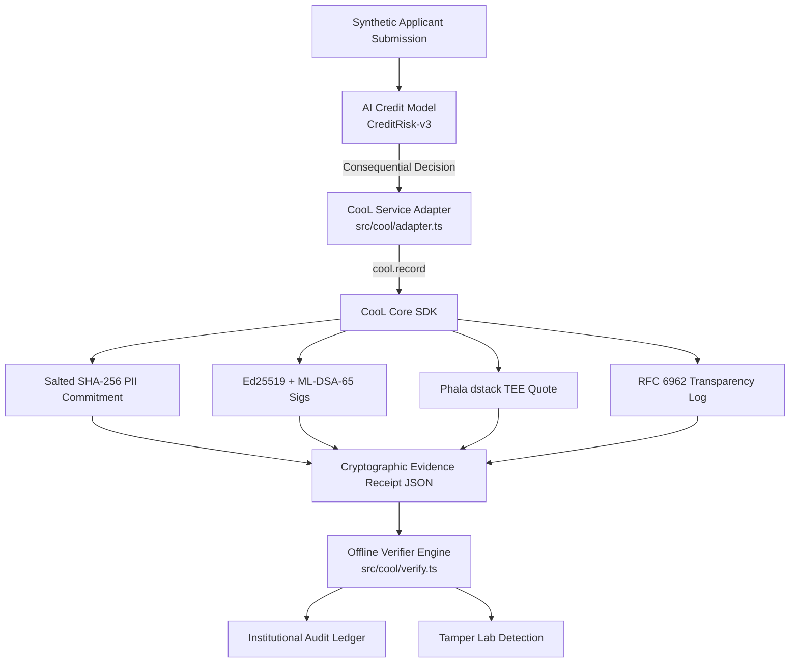

# 🛡️ CooL.ledger — AI Decision Evidence & Audit Platform

## THE PROBLEM
AI systems increasingly make consequential decisions (such as autonomous credit underwriting, loan approvals, and risk scoring), but ordinary database logs are editable, backdatable, and centralized — failing to provide independently verifiable evidence of what actually happened at execution time.

## THE SOLUTION
This product uses **CooL** at the AI decision boundary to create cryptographically verifiable evidence that can later be audited 100% offline with zero vendor API dependencies.

## WHY COOL MATTERS

> *"At the consequential AI decision boundary, CooL creates the cryptographic evidence that the rest of the application audits. Without this evidence layer, the application falls back to ordinary application logs and cannot provide the same verification guarantees."*

CooL SDK is actively invoked at the moment of decision generation:
- **`cool.record()` (`src/cool/client.ts`)**: Commits salted PII commitments, hybrid signatures, TEE enclave quotes, and RFC 6962 transparency log entries.
- **`verifyReceipt()` (`src/cool/verify.ts`)**: Evaluates 5 independent fail-closed cryptographic criteria offline.
- **`createSaltedCommitment()` (`src/cool/hash.ts`)**: Seals raw applicant input and decision output into SHA-256 state commitments (`H(SALT : input || output)`), ensuring zero raw PII is exposed.
- **`createHybridSignatures()` (`src/cool/sign.ts`)**: Dual Ed25519 classical and ML-DSA-65 (Dilithium FIPS 204) post-quantum signing.
- **`createTEEAttestation()` (`src/cool/phala/dstack.ts`)**: Hardware-rooted Phala Network dstack TEE execution environment quotes.
- **`appendToTransparencyLog()` (`src/cool/phala/log.ts`)**: RFC 6962 append-only Merkle tree inclusion proofs.

---

## Architecture & System Flow

```
AI Model
   ↓
Decision Boundary
   ↓
CooL SDK
   ↓
Cryptographic Evidence
   ↓
Receipt
   ↓
Audit / Verification
```



---

## CooL Integration Map

Decision generation:
[creditModel.ts](file:///c:/Users/Tejas/Desktop/Reverse-Hackthon/src/model/creditModel.ts)

CooL record:
[adapter.ts](file:///c:/Users/Tejas/Desktop/Reverse-Hackthon/src/cool/adapter.ts)

Evidence storage:
[evidenceService.ts](file:///c:/Users/Tejas/Desktop/Reverse-Hackthon/src/services/evidenceService.ts)

Verification:
[verify.ts](file:///c:/Users/Tejas/Desktop/Reverse-Hackthon/src/cool/verify.ts)

Tamper detection:
[TamperLabTab.tsx](file:///c:/Users/Tejas/Desktop/Reverse-Hackthon/src/components/TamperLabTab.tsx)

---

## Decision → Evidence Workflow
1. User submits synthetic applicant (`Synthetic Applicant #8842`).
2. Credit model (`CreditRisk-v3`) produces autonomous decision (`APPROVED`).
3. Consequential decision boundary invokes `coolAdapter.recordDecisionEvidence()`.
4. CooL SDK seals salted state hash `H(SALT : input || output)`.
5. Ed25519 & ML-DSA-65 signatures, Phala dstack TEE quote, and RFC 6962 Merkle log proof are generated.
6. Clean evidence receipt JSON is returned and persisted.

---

## Verification & Tamper Demonstration
1. **Verification Workflow:** Auditor opens receipt in **Evidence Receipt** inspector or CLI, clicks **VERIFY EVIDENCE**, and evaluates 5 offline checks (`✓ Evidence authentic`).
2. **Tamper Demonstration:** Open **Tamper Lab**, click **TAMPER WITH EVIDENCE** to flip decision or mutate income. Offline verifier evaluates payload and returns `EVIDENCE TAMPERED` & `✗ Verification failed`. Click **Restore Original** to restore receipt and re-verify (`ORIGINAL: ✓ VERIFIED`).

---

## Local Setup & Deployment

```bash
# 1. Install dependencies
npm install

# 2. Run local development server
npm run dev

# 3. Run Vitest test suite
npx vitest run

# 4. Build for production
npm run build

# 5. Vercel deployment
npx vercel
```

---

## Environment Variables (`.env.example`)

```bash
VITE_COOL_DOMAIN=nbfc.credit_scoring
VITE_ENABLE_TEE_ATTESTATION=true
VITE_MODEL_ID=CreditRisk-v3
VITE_MODEL_VERSION=3.4.1-prod
```

---

## Security Assumptions & System Limitations
- **Browser TEE Simulation:** Browser environments execute web-subtle crypto for hash commitments. Hardware SGX/TDX quote attestation is simulated via Phala dstack client specification.
- **Scope Disclaimer:** CooL cryptographic verification proves **record non-repudiation and evidence integrity**. It does **not** prove model fairness, accuracy, or bias-free execution.
