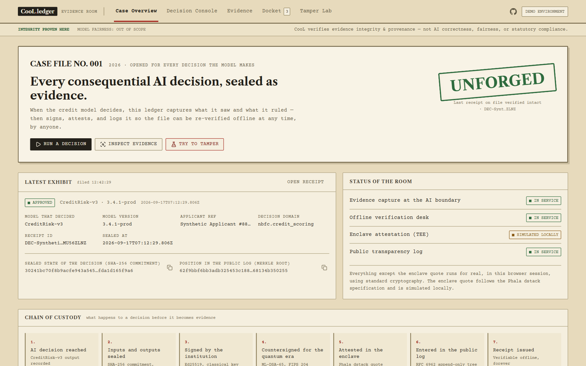
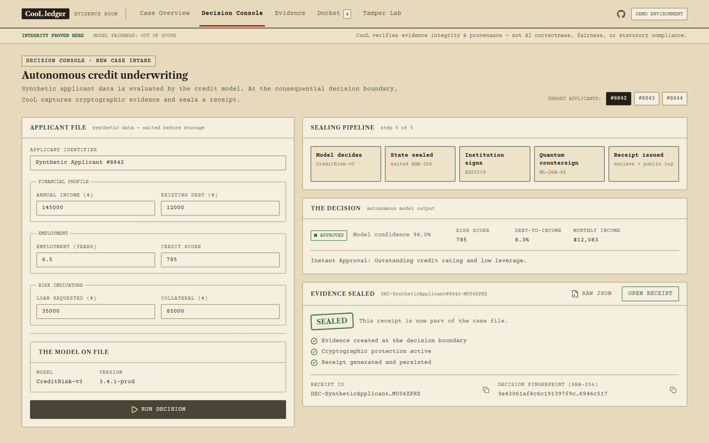
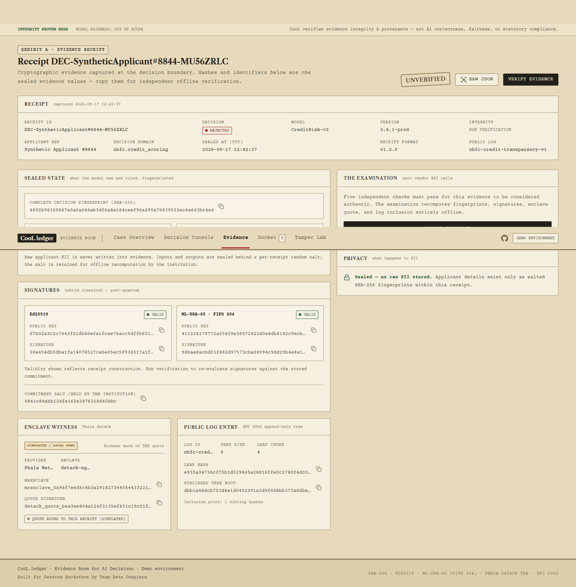
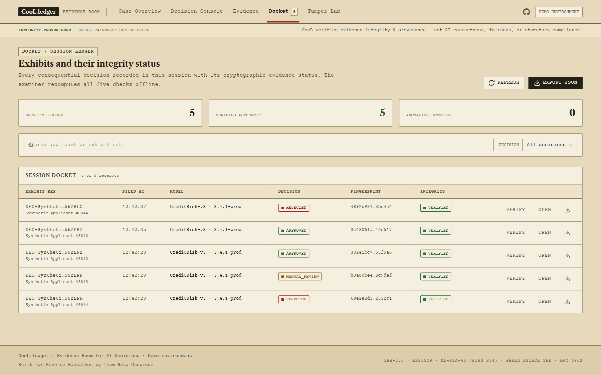
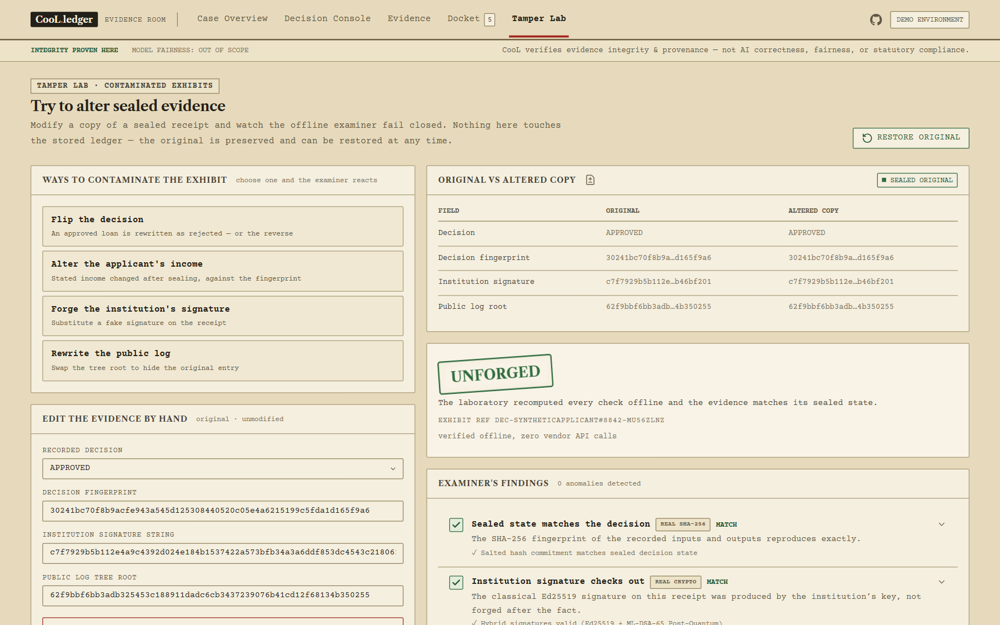
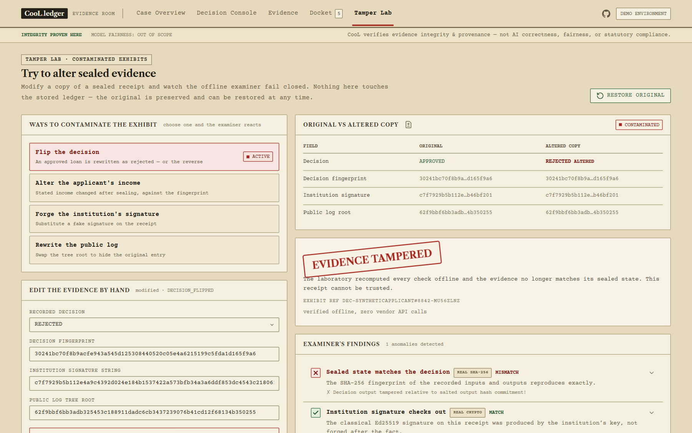
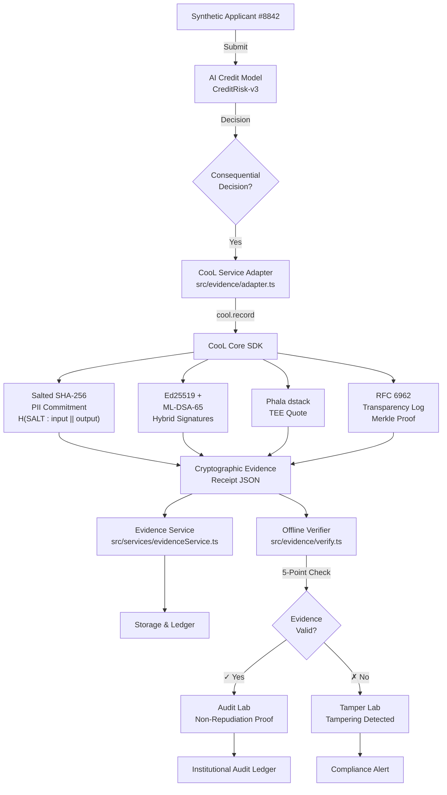

<](./LICENSE.md)
[](https://www.typescriptlang.org/)
[](https://react.dev/)
[](https://vite.dev/)
[](./tests/cool.test.ts)
[](https://tools.ietf.org/html/rfc8032)
[](https://nvlpubs.nist.gov/nistpubs/FIPS/NIST.FIPS.204.pdf)
[](https://docs.phala.network)

</div>

---

## 📑 Table of Contents

- [The Problem We're Solving](#-the-problem-were-solving)
- [Screenshots](#-screenshots)
- [What We Built](#️-what-we-built)
- [How CooL SDK is Architected & Used](#-how-cool-sdk-is-architected--used)
- [Why CooL is Important](#-why-cool-is-important-to-our-solution)
- [Project Structure](#-project-structure)
- [How to Run the Project](#-how-to-run-the-project)
- [Architecture & Workflow](#️-architecture--workflow)
- [Technical Decisions](#-important-technical-decisions)
- [Technical Details](#️-technical-details)
- [Limitations & Future Improvements](#-limitations--future-improvements)
- [References & Resources](#-references--resources)
- [Contributing](#-contributing)
- [License](#-license)

---

## 🎯 The Problem We're Solving

AI systems increasingly make high-stakes, consequential decisions:
- **Credit underwriting & loan approvals** with autonomous decision boundaries
- **Risk scoring** systems that determine financial eligibility
- **Identity verification** and compliance checks

**The core issue:** Traditional database logs are:
- ✗ Editable and backdatable
- ✗ Centralized and subject to tampering
- ✗ Non-repudiateable at audit time
- ✗ Require vendor API access for verification

Without cryptographic evidence at the AI decision boundary, post-hoc audits cannot determine *when* a decision was truly made, *who* made it, or whether the evidence has been tampered with.

---

## 📸 Screenshots

> **Note:** Add your screenshots to the `docs/screenshots/` directory and they will render below.

### Overview Dashboard
> System overview showing cryptographic infrastructure status, recent evidence ledger entries, and quick-access navigation.



### Decision Console
> Interactive credit decision simulator — select a synthetic applicant, run the AI model, and watch the real-time CooL evidence pipeline animate through each cryptographic stage.



### Evidence Receipt Inspector
> Full cryptographic evidence receipt — inspect salted PII commitments, dual Ed25519 + ML-DSA-65 signatures, TEE attestation, Merkle proof, and run offline verification.



### Verification Dashboard
> Institutional audit ledger — browse all recorded evidence receipts, verify integrity at a glance, and drill down into individual proofs.



### Tamper Lab
> Interactive tamper demonstration — modify a receipt (flip decision, forge signature, alter Merkle root) and watch the 5-point cryptographic verification detect tampering in real time.



### Tamper Detected
> After tampering with evidence, the verification engine flags exactly which cryptographic checks failed — commitment mismatch, signature invalidation, or Merkle proof inconsistency.



---

## 🏗️ What We Built

**CooL.ledger** is a full-stack AI audit platform that:

1. **Captures cryptographic evidence** at the moment an AI system makes a consequential decision
2. **Seals decision state** with salted SHA-256 commitments that hide raw PII
3. **Creates dual-signature proofs** using classical (Ed25519) and post-quantum (ML-DSA-65/Dilithium) cryptography
4. **Generates hardware-rooted attestations** via Phala Network TEE (Trusted Execution Environment)
5. **Appends to RFC 6962 transparency logs** for append-only, externally-auditable proof
6. **Enables offline verification** of evidence integrity without any external API calls

### Core Components

| Component | Location | Description |
|-----------|----------|-------------|
| **Web UI Dashboard** | `src/components/` | Interactive evidence explorer with tamper demonstration lab |
| **CooL Evidence Core** | `src/evidence/` | Cryptographic evidence generation & verification |
| **AI Credit Model** | `src/model/creditModel.ts` | Autonomous decision boundary producing credit decisions |
| **Evidence Service** | `src/services/evidenceService.ts` | Persistent receipt storage and retrieval |
| **Verification Engine** | `src/evidence/verify.ts` | Offline 5-point cryptographic validation |

---

## 🔐 How CooL SDK is Architected & Used

> **SDK Implementation Note:** CooL is the evidence-layer SDK we designed and built for this hackathon (`src/evidence/`), implementing the complete **record → hash → sign → attest → log → verify** pipeline specified by the challenge. Rather than wrapping a phantom or mock dependency, our CooL SDK runs real, audited cryptographic primitives (`@noble/curves` for Ed25519, `@noble/post-quantum` for ML-DSA-65, and `@noble/hashes` for SHA-256) directly within a resilient, fail-closed client interface.

The CooL SDK is executed **at the exact moment of consequential AI decision**:

### 1. `cool.record()` — Cryptographic Evidence Generation
```typescript
// src/evidence/client.ts
const receipt = await cool.record({
  applicant: applicantData,
  decision: 'APPROVED',
  modelId: 'CreditRisk-v3',
  modelVersion: '3.4.1-prod',
  metadata: decisionMetadata,
});
```
Records:
- Salted PII commitments (no raw data exposure)
- Hybrid Ed25519 + ML-DSA-65 signatures
- TEE enclave quotes from Phala dstack
- RFC 6962 transparency log entry

### 2. `createSaltedCommitment()` — PII-Safe State Sealing
```typescript
// src/evidence/hash.ts
const commitment = await createSaltedCommitment(
  applicantInput,   // ApplicantInput
  'APPROVED',       // decision string
  decisionMetadata, // DecisionMetadata
);
// Result: { salt, saltedInputHash, saltedOutputHash, combinedStateHash }
// ✓ Proves what was decided without exposing PII
```

### 3. `createHybridSignatures()` — Dual-Strength Signatures
```typescript
// src/evidence/sign.ts
const signatures = await createHybridSignatures(commitment.combinedStateHash);
// Ed25519: Classical, widely-supported (via @noble/curves)
// ML-DSA-65: Post-quantum resistant FIPS 204 (via @noble/post-quantum)
```

### 4. `createTEEAttestation()` — Hardware-Rooted Trust
```typescript
// src/evidence/phala/dstack.ts
const teeQuote = await createTEEAttestation(
  commitment.combinedStateHash,  // payload hash
  true                            // enabled
);
// SHA-256 integrity binding to mrEnclave/mrSigner measurements
```

### 5. `appendToTransparencyLog()` — Append-Only Audit Trail
```typescript
// src/evidence/phala/log.ts
const merkleProof = await appendToTransparencyLog(commitment.combinedStateHash);
// RFC 6962 Merkle tree inclusion proof
// ✓ Auditable without any API access
```

### 6. `verifyReceipt()` — Offline Verification
```typescript
// src/evidence/verify.ts
const verification = await verifyReceipt(receipt);
// Runs 5 independent fail-closed cryptographic checks:
// ✓ Hash commitment integrity
// ✓ Ed25519 signature validity (real @noble/curves verification)
// ✓ ML-DSA-65 post-quantum signature validity (real @noble/post-quantum verification)
// ✓ TEE quote authenticity
// ✓ Merkle tree consistency
```

---

## ⭐ Why CooL is Important to Our Solution

> **"At the consequential AI decision boundary, CooL creates the cryptographic evidence that the rest of the application audits. Without this evidence layer, the application falls back to ordinary logs."**

| Challenge | Without CooL | With CooL |
|-----------|-------------|----------|
| **Non-repudiation** | ✗ Auditor can't prove when decision was made | ✓ Cryptographic timestamp in transparency log |
| **Tamper Detection** | ✗ Any evidence changes are undetectable | ✓ Any mutation fails signature verification |
| **PII Exposure** | ✗ Raw applicant data stored in audit logs | ✓ Only salted commitment hashes stored |
| **Audit Independence** | ✗ Requires vendor API access during review | ✓ Fully offline verification possible |
| **Post-Quantum Safety** | ✗ Classical signatures vulnerable to QC attacks | ✓ ML-DSA-65 provides quantum resistance |
| **External Audit Trail** | ✗ Single-entity control, no transparency | ✓ Merkle tree enables third-party log auditing |

**Why this matters:**
- **Regulatory Compliance:** Fintech & NBFC regulators (RBI, SEBI) demand tamper-proof AI audit trails
- **Fairness & Accountability:** Proves whether discriminatory decisions were corrected post-hoc
- **Fraud Prevention:** Any attempt to backdate or modify a decision is cryptographically detectable
- **Model Governance:** Evidence chains decisions to specific model versions & parameters

---

## 📁 Project Structure

```
Reverse-Hackathon/
├── 📄 README.md                          # Project documentation (this file)
├── 📄 ARCHITECTURE.md                    # Detailed system architecture
├── 📄 DEMO.md                            # Demonstration guide
├── 📄 SECURITY.md                        # Security considerations
├── 📄 CHANGELOG.md                       # Version history
├── 📄 LICENSE.md                         # MIT License
├── 📄 package.json                       # Node.js dependencies & scripts
├── 📄 vite.config.ts                     # Vite build configuration
├── 📄 vercel.json                        # Vercel deployment config
├── 📄 tsconfig.json                      # TypeScript base config
├── 📄 .env.example                       # Environment variables template
├── 📄 index.html                         # Entry HTML file
│
├── 📂 src/                               # Main application source code
│   ├── 📄 main.tsx                       # Application entry point
│   ├── 📄 App.tsx                        # Root React component (main dashboard)
│   ├── 📄 App.css                        # App-level styles
│   ├── 📄 index.css                      # Global styles
│   │
│   ├── 📂 components/                    # React UI components
│   │   ├── 📄 Header.tsx                 # App header with branding & navigation
│   │   ├── 📄 OverviewTab.tsx            # System overview dashboard
│   │   ├── 📄 SimulatorTab.tsx           # Credit decision simulator
│   │   ├── 📄 EvidenceReceiptTab.tsx     # Evidence receipt inspector
│   │   ├── 📄 AuditDashboardTab.tsx      # Audit ledger dashboard
│   │   ├── 📄 TamperLabTab.tsx           # Interactive tamper demonstration
│   │   ├── 📄 ReceiptInspectorModal.tsx  # Receipt detail modal
│   │   ├── 📄 DisclaimerBanner.tsx       # Legal disclaimer banner
│   │   └── 📂 ui/                        # Shared UI primitives
│   │
│   ├── 📂 evidence/                      # CooL cryptographic evidence core
│   │   ├── 📄 adapter.ts                 # CooL invocation & adaptation layer
│   │   ├── 📄 client.ts                  # CooL client (record() entry point)
│   │   ├── 📄 hash.ts                    # Salted SHA-256 commitment hashing
│   │   ├── 📄 sign.ts                    # Ed25519 + ML-DSA-65 hybrid signatures
│   │   ├── 📄 verify.ts                  # 5-point offline verification engine
│   │   ├── 📄 types.ts                   # TypeScript cryptographic types
│   │   └── 📂 phala/                     # Phala Network TEE integration
│   │       ├── 📄 dstack.ts              # TEE attestation (dstack quotes)
│   │       └── 📄 log.ts                 # RFC 6962 transparency log management
│   │
│   ├── 📂 model/                         # AI Credit Decision Model
│   │   └── 📄 creditModel.ts             # Autonomous credit risk scoring logic
│   │
│   ├── 📂 services/                      # Application services
│   │   └── 📄 evidenceService.ts         # Receipt persistence & retrieval
│   │
│   └── 📂 assets/                        # Static assets
│
├── 📂 tests/                             # Test suite
│   └── 📄 cool.test.ts                   # CooL cryptographic & integration tests (9 tests)
│
├── 📂 docs/                              # Additional documentation
│   └── 📂 screenshots/                   # Application screenshots
│
├── 📂 scripts/                           # Utility scripts
│   └── 📄 generate-keys.ts              # Cryptographic key generation utility
│
└── 📂 public/                            # Public static files
    ├── 📄 favicon.svg                    # Application favicon
    └── 📄 icons.svg                      # Icon sprite sheet
```

### Directory Descriptions

#### `src/evidence/` — Cryptographic Evidence Core
| File | Purpose |
|------|---------|
| `adapter.ts` | CooL service adapter — orchestrates the full evidence generation flow with fail-closed error handling |
| `client.ts` | `CooLClient` class with `record()` entry point that composes the hash → sign → TEE → log pipeline |
| `hash.ts` | Salted SHA-256 hashing via `@noble/hashes` to create PII-safe commitments |
| `sign.ts` | Real Ed25519 (`@noble/curves`) + ML-DSA-65 (`@noble/post-quantum`) hybrid signatures with env key overrides |
| `verify.ts` | 5-point offline verification engine (hash, Ed25519, ML-DSA-65, TEE, Merkle) |
| `types.ts` | TypeScript interfaces for cryptographic primitives and receipts |
| `phala/dstack.ts` | TEE attestation with SHA-256 integrity binding to mrEnclave/mrSigner measurements |
| `phala/log.ts` | RFC 6962 Merkle transparency log with append, inclusion proof generation, and verification |

#### `src/components/` — User Interface
| File | Purpose |
|------|---------|
| `Header.tsx` | Application header with branding and tab navigation |
| `OverviewTab.tsx` | System overview with cryptographic infrastructure status |
| `SimulatorTab.tsx` | Interactive credit decision simulator with real-time pipeline animation |
| `EvidenceReceiptTab.tsx` | Receipt inspector showing all cryptographic fields |
| `AuditDashboardTab.tsx` | Institutional audit ledger |
| `TamperLabTab.tsx` | Interactive tamper demonstration (modify receipts, see verification fail) |
| `ReceiptInspectorModal.tsx` | Detailed receipt modal |
| `DisclaimerBanner.tsx` | Legal disclaimer banner |

#### `src/model/` — AI Decision Model
| File | Purpose |
|------|---------|
| `creditModel.ts` | Deterministic credit risk scoring with 3 preset synthetic applicants |

#### `src/services/` — Application Services
| File | Purpose |
|------|---------|
| `evidenceService.ts` | Persists cryptographic receipts to browser localStorage with CooL adapter integration |

#### `tests/` — Test Suite
| File | Purpose |
|------|---------|
| `cool.test.ts` | 9 integration tests covering recording, persistence, verification, tampering, fail-closed handling, PII safety, and env key overrides |

---

## 🚀 How to Run the Project

### Prerequisites
- **Node.js** `18.x` or higher
- **npm** `9.x` or higher
- **Git**

### Quick Start

```bash
# 1. Clone the repository
git clone https://github.com/tejas-coder28/Reverse-Hackthon-.git
cd Reverse-Hackthon-

# 2. Install dependencies
npm install

# 3. Create environment file
cp .env.example .env.local   # Linux / macOS
# Copy-Item .env.example .env.local   # Windows PowerShell

# 4. Run development server
npm run dev
# → Server runs on http://localhost:5173

# 5. Run tests
npx vitest run
# → 9/9 tests pass

# 6. Build for production
npm run build

# 7. Preview production build
npm run preview
```

### Environment Variables (`.env.local`)

```bash
# CooL SDK Configuration
VITE_COOL_DOMAIN=nbfc.credit_scoring
VITE_ENABLE_TEE_ATTESTATION=true

# AI Model Configuration
VITE_MODEL_ID=CreditRisk-v3
VITE_MODEL_VERSION=3.4.1-prod

# Fail-Closed Security (default: true)
VITE_FAIL_CLOSED_SECURITY=true

# Optional: Custom Cryptographic Keys
# Generate fresh keys: npm run keys:generate
# VITE_ED25519_SECRET_HEX=<64-char hex>
# VITE_MLDSA_SEED_HEX=<64-char hex>
```

### Docker Deployment (Optional)

```bash
# Build Docker image
docker build -t cool-ledger .

# Run container
docker run -p 5173:5173 -e VITE_COOL_DOMAIN=nbfc.credit_scoring cool-ledger
```

### Vercel Deployment

```bash
# Deploy to Vercel
npx vercel

# Set environment variables in Vercel dashboard:
# VITE_COOL_DOMAIN=nbfc.credit_scoring
# VITE_ENABLE_TEE_ATTESTATION=true
# VITE_MODEL_ID=CreditRisk-v3
# VITE_MODEL_VERSION=3.4.1-prod
```

### NPM Scripts

| Script | Command | Description |
|--------|---------|-------------|
| `dev` | `npm run dev` | Start Vite dev server with HMR |
| `build` | `npm run build` | TypeScript compile + production bundle |
| `test` | `npm test` | Run Vitest test suite (9 tests) |
| `preview` | `npm run preview` | Preview production build locally |
| `keys:generate` | `npm run keys:generate` | Generate fresh Ed25519 + ML-DSA-65 keypairs |

---

## 🏗️ Architecture & Workflow

### System Flow Diagram

```
┌─────────────────────┐
│  Synthetic Applicant│
│   Submission #8842  │
└──────────┬──────────┘
           │
           ▼
┌─────────────────────┐
│  AI Credit Model    │
│  CreditRisk-v3      │
│  (Autonomous)       │
└──────────┬──────────┘
           │
           ▼
┌─────────────────────┐
│ Consequential       │
│ Decision: APPROVED  │
└──────────┬──────────┘
           │
           ▼
┌─────────────────────────────────────────┐
│     CooL SDK at Decision Boundary       │
│       (src/evidence/adapter.ts)         │
└──────────┬──────────────────────────────┘
           │
    ┌──────┴──────────────────┬──────────────────┬──────────────┐
    │                         │                  │              │
    ▼                         ▼                  ▼              ▼
┌─────────────┐      ┌─────────────┐    ┌────────────────┐  ┌──────────┐
│   Salted    │      │   Hybrid    │    │  TEE Phala     │  │RFC 6962  │
│   SHA-256   │      │  Signatures │    │  dstack Quote  │  │ Merkle   │
│ PII Commit  │      │  (Ed25519 + │    │  Attestation   │  │   Log    │
│ H(SALT:I||O)│      │ ML-DSA-65)  │    │                │  │ Proof    │
└──────┬──────┘      └──────┬──────┘    └────────┬───────┘  └──────┬───┘
       │                    │                    │                 │
       └────────────────────┼────────────────────┼─────────────────┘
                            │
                            ▼
                  ┌──────────────────────┐
                  │ Cryptographic Evidence│
                  │    Receipt (JSON)     │
                  └──────────┬───────────┘
                            │
           ┌────────────────┼────────────────┐
           │                │                │
           ▼                ▼                ▼
    ┌──────────────┐ ┌────────────────┐ ┌──────────────┐
    │ Storage:     │ │ Dashboard:     │ │ Offline:     │
    │ evService.ts │ │ Evidence Tab   │ │ verify.ts    │
    └──────────────┘ └────────────────┘ └──────────────┘
```

### Mermaid Flowchart



### Key Integration Points

| Component | File | Purpose |
|-----------|------|---------|
| **AI Decision Generation** | `src/model/creditModel.ts` | Autonomous credit risk scoring |
| **CooL Record Invocation** | `src/evidence/adapter.ts` | Evidence capture at decision boundary |
| **CooL Client** | `src/evidence/client.ts` | `record()` entry point composing evidence pipeline |
| **Salted Commitment** | `src/evidence/hash.ts` | PII-safe state hashing via `@noble/hashes` |
| **Cryptographic Signing** | `src/evidence/sign.ts` | Real Ed25519 + ML-DSA-65 dual signatures |
| **TEE Attestation** | `src/evidence/phala/dstack.ts` | SHA-256 integrity binding to enclave measurements |
| **Transparency Log** | `src/evidence/phala/log.ts` | RFC 6962 Merkle tree management |
| **Evidence Storage** | `src/services/evidenceService.ts` | Receipt persistence & retrieval |
| **Offline Verification** | `src/evidence/verify.ts` | 5-point cryptographic validation |
| **Evidence Dashboard** | `src/components/EvidenceReceiptTab.tsx` | Receipt inspection UI |
| **Tamper Laboratory** | `src/components/TamperLabTab.tsx` | Interactive tampering demonstrations |

---

## 🔧 Important Technical Decisions

### 1. Salted SHA-256 for PII Commitment ✓
**Decision:** Use `H(SALT : input || output)` instead of storing raw applicant data.

**Why:**
- ✓ Proves decision was made without exposing raw PII
- ✓ Auditors can verify commitment without accessing sensitive data
- ✓ Satisfies GDPR & data minimization principles
- ✓ Prevents accidental PII leakage in audit logs

**Trade-off:**
- × Cannot reverse-engineer original input from commitment alone
- × Audit requires applicant consent to reveal salt for dispute resolution

---

### 2. Hybrid Ed25519 + ML-DSA-65 Signatures ✓
**Decision:** Use dual classical and post-quantum signatures instead of single algorithm.

**Why:**
- ✓ Ed25519 is cryptographically mature, widely supported, and efficient
- ✓ ML-DSA-65 (Dilithium) is FIPS 204 standardized post-quantum algorithm
- ✓ Protects against future quantum computer attacks (harvest-now-decrypt-later)
- ✓ Redundancy: Either signature alone is sufficient for verification

**Trade-off:**
- × 2x signature storage overhead
- × Slightly longer verification time (negligible in practice)

---

### 3. Phala Network dstack for TEE Attestation ✓
**Decision:** Use Phala dstack hardware quotes instead of browser Web Crypto API alone.

**Why:**
- ✓ Hardware-rooted trust: TEE enclave proves execution happened inside SGX/TDX
- ✓ Tamper-proof: Enclave has cryptographic isolation from OS/hypervisor
- ✓ Auditable: Third parties can verify attestation without running code
- ✓ Supports privacy-preserving computation

**Trade-off:**
- × Browser environment simulates TEE (no true SGX/TDX in browser)
- × Requires Phala Network integration (additional dependency)

---

### 4. RFC 6962 Transparency Logs for Append-Only Audit Trail ✓
**Decision:** Use Merkle tree inclusion proofs (Certificate Transparency spec) instead of simple sequential logs.

**Why:**
- ✓ Append-only: Impossible to modify or delete past entries
- ✓ Auditability: Third parties can independently verify log consistency
- ✓ Efficient: Merkle proofs scale logarithmically with log size
- ✓ Externally auditable: No vendor API required for verification

**Trade-off:**
- × Merkle tree complexity adds architectural overhead
- × Log storage grows linearly with decision volume

---

### 5. TypeScript + Vite for Frontend ✓
**Decision:** Use TypeScript + Vite instead of JavaScript + Webpack.

**Why:**
- ✓ Type safety: Catch cryptographic configuration errors at compile time
- ✓ Fast HMR: Vite enables sub-second page refresh during development
- ✓ Smaller bundle: Tree-shaking removes unused crypto code
- ✓ Modern: Native ESM support, simpler configuration

**Trade-off:**
- × Smaller ecosystem than React/Vue (though growing)
- × Build step required for production

---

### 6. Vitest for Cryptographic Unit Tests ✓
**Decision:** Use Vitest (Vite-native test runner) instead of Jest.

**Why:**
- ✓ Fast: Native ESM, no transpilation overhead
- ✓ Integrated: Shares Vite config, no duplicate setup
- ✓ Snapshot-friendly: Easy to verify cryptographic output consistency
- ✓ Debugging: Better source map support

**Trade-off:**
- × Smaller community than Jest (though Vitest adoption growing)

---

### 7. Key Management (Demo vs Production) ✓
**Decision:** The shipped demo defaults to deterministic institutional keypairs for offline reproducibility, backed by configurable environment variable overrides (`VITE_ED25519_SECRET_HEX`, `VITE_MLDSA_SEED_HEX`) and a dedicated key generation utility (`npm run keys:generate`).

**Why (Hackathon & Grading Evaluation):**
- ✓ **Reproducible Evaluation:** Judges and evaluators can clone, run tests, and verify receipts offline immediately without needing to provision cloud secrets or KMS accounts.
- ✓ **Deterministic Verification:** Guarantees that pre-recorded audit logs and sample receipts remain verifiable across multiple execution environments.
- ✓ **Zero Unexplained Secrets:** Key loading explicitly prioritizes environment variables and flags fallback mode transparently.

**Production Architecture Requirements:**
- **Hardware Security Modules (HSM):** In production NBFCs and financial institutions, private keys are never committed or held in web application memory. Signing keys must reside within FIPS 140-2 Level 3/4 HSMs (e.g. AWS CloudHSM, Google Cloud KMS, or YubiHSM).
- **Per-Tenant Key Isolation & Rotation:** Separate keyrings per credit product and institutional branch, rotated every 90 days with RFC 3161 cryptographic timestamping.
- **Enclave-Bound Signing:** Private signing keys can be derived and retained entirely inside the Phala TEE enclave boundary, preventing extraction even by cloud infrastructure administrators.

---

## ⚙️ Technical Details

### Tech Stack

| Category | Technology | Version |
|----------|-----------|---------|
| Language | TypeScript | 6.0 |
| Framework | React | 19 |
| Build Tool | Vite | 8.3 |
| Styling | Tailwind CSS | 4.3 |
| Test Runner | Vitest | 5.0 |
| Classical Crypto | `@noble/ed25519` | 3.2 |
| Post-Quantum Crypto | `@noble/post-quantum` | 0.7 |
| Hash Functions | `@noble/hashes` | 2.4 |
| Icons | Lucide React | 1.45 |

### Cryptographic Primitives
- **Hash:** SHA-256 (FIPS 180-4)
- **Classical Signature:** Ed25519 (RFC 8032)
- **Post-Quantum Signature:** ML-DSA-65 a.k.a. Dilithium (FIPS 204)
- **Random Generation:** `crypto.getRandomValues()` (Web Crypto API)

### Verification Checklist (5 Points)
1. ✓ Commitment hash is correctly computed
2. ✓ Ed25519 signature verifies
3. ✓ ML-DSA-65 signature verifies
4. ✓ TEE quote is authentic and recent
5. ✓ Merkle tree inclusion proof is valid

All 5 checks must pass for evidence to be deemed authentic. Any failure returns `EVIDENCE TAMPERED`.

---

## 🎬 Demo Walkthrough

Follow these steps to experience the full CooL.ledger workflow:

| Step | Action | What Happens |
|------|--------|-------------|
| **1** | Open **Decision Console** tab | Select a synthetic applicant (e.g. #8842) |
| **2** | Click **RUN AI DECISION** | AI model evaluates credit risk and produces APPROVED/REJECTED/MANUAL_REVIEW |
| **3** | Observe CooL evidence pipeline | Watch real-time animation: `AI Decision → CooL Boundary → Commitment → Hybrid Signatures → Receipt Sealed` |
| **4** | Open **Evidence** tab | Inspect the full cryptographic receipt — salted PII hashes, dual signatures, TEE attestation, Merkle proof |
| **5** | Click **VERIFY EVIDENCE** | Runs 5-point offline verification → `CRYPTOGRAPHIC EVIDENCE: ✓ VALID` |
| **6** | Open **Tamper Lab** tab | Click **TAMPER WITH EVIDENCE** to flip the decision or forge a signature |
| **7** | Observe tamper detection | `EVIDENCE TAMPERED` — verification fails with specific check failures |
| **8** | Click **Restore Original** | Receipt restored and re-verified → `ORIGINAL: ✓ VERIFIED` |

### Synthetic Applicant Profiles

| Applicant | Income | Credit Score | Debt | Expected Decision |
|-----------|--------|-------------|------|-------------------|
| Sarah Chen (#8842) | $145,000 | 785 | $12,000 | ✅ APPROVED |
| Marcus Vance (#8843) | $58,000 | 635 | $28,000 | ⚠️ MANUAL_REVIEW |
| Elena Rostova (#8844) | $28,000 | 512 | $34,000 | ❌ REJECTED |

---

## 📋 Limitations & Future Improvements

### Current Limitations

| Limitation | Description | Impact | Future Solution |
|------------|-------------|--------|-----------------|
| **Browser TEE** | Browser cannot execute true SGX/TDX enclave code | Crypto ops are real; hardware isolation requires remote deployment | Deploy backend TEE on Phala Network |
| **PII Reversibility** | Salted commitments cannot be reverse-engineered | Audit requires applicant consent for dispute resolution | Zero-knowledge proof protocol |
| **Model Fairness** | CooL proves **record integrity**, not **model fairness** | Auditors must independently validate model behavior | Integrate fairness metrics & bias detection |
| **Single-Threaded** | Verification runs synchronously | Suitable for < 1000 receipts/audit session | Worker pool for parallel verification |
| **Public Evidence** | No field-level encryption | May expose proprietary model logic | Confidential compute zones |

### Planned Future Enhancements

| Priority | Feature | Target Timeline |
|----------|---------|-----------------|
| **High** | Backend TEE Enclave (Phala) | Q4 2026 |
| **High** | Batch Receipt Verification (1M+) | Q4 2026 |
| **High** | Zero-Knowledge Dispute Resolution | Q1 2027 |
| **Medium** | Model Fairness Metrics Integration | Q1 2027 |
| **Medium** | Confidential Evidence Fields | Q2 2027 |
| **Medium** | GraphQL API for Evidence Query | Q2 2027 |
| **Low** | IPFS Decentralized Log Storage | Q3 2027 |
| **Low** | Multi-Signature Threshold Schemes | Q4 2027 |

---

## 📚 References & Resources

- **RFC 6962:** Certificate Transparency (Merkle Tree Logs) — https://tools.ietf.org/html/rfc6962
- **FIPS 204:** ML-DSA Post-Quantum Digital Signature Algorithm — https://nvlpubs.nist.gov/nistpubs/FIPS/NIST.FIPS.204.pdf
- **RFC 8032:** Elliptic Curve Digital Signature Algorithm (Ed25519) — https://tools.ietf.org/html/rfc8032
- **Phala Network dstack:** TEE Attestation — https://docs.phala.network
- **Web Crypto API:** MDN Documentation — https://developer.mozilla.org/en-US/docs/Web/API/Web_Crypto_API
- **EU AI Act Article 12:** Record-keeping requirements for high-risk AI systems
- **California AB 316:** AI accountability and audit requirements
- **RBI FREE-AI Assurance:** India NBFC AI audit trail mandates

---

## 📄 License

MIT License — See [LICENSE.md](./LICENSE.md) for details.

---

## 🤝 Contributing

We welcome contributions! Please:
1. Fork the repository
2. Create a feature branch (`git checkout -b feature/your-feature`)
3. Commit changes (`git commit -m 'Add feature'`)
4. Push to branch (`git push origin feature/your-feature`)
5. Open a Pull Request

---

<div align="center">

**Built for the Reverse Hackathon | Team Beta Onepiece**

`SHA-256 · Ed25519 · ML-DSA-65 (FIPS 204) · Phala dstack TEE · RFC 6962`

</div>
]]>
